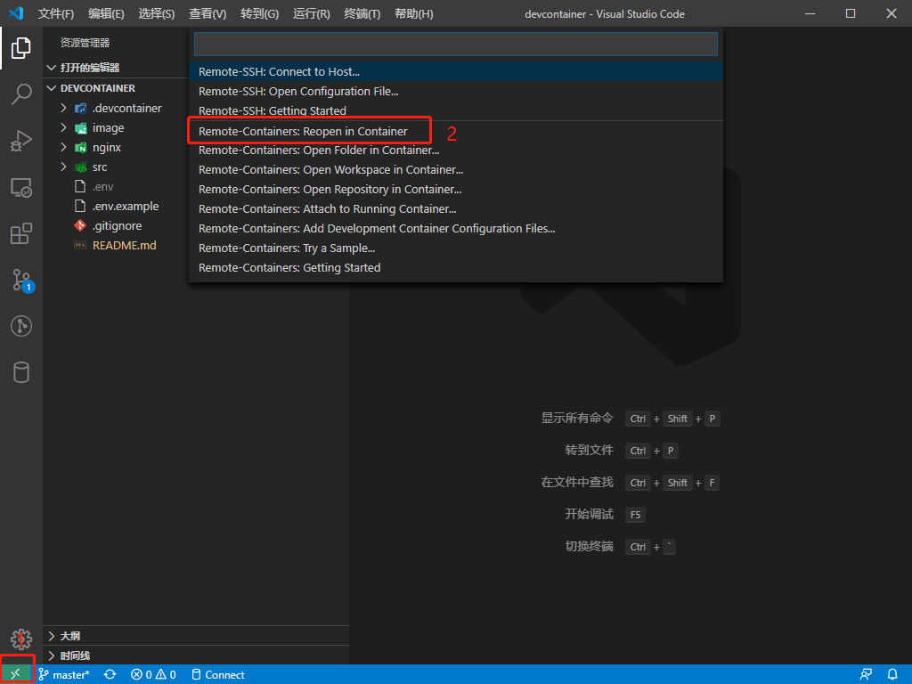
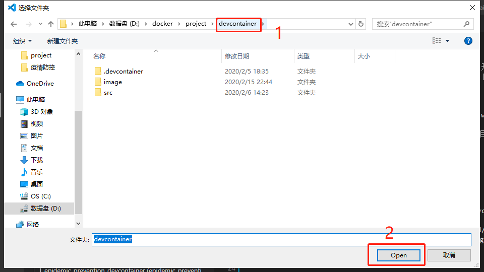

## 简介

本项目结合 VS Code 的 Remote - Containers 插件搭建 Node 开发环境。

## 环境搭建

首先需要安装 Docker 如果是 windows 系统的话则是安装 docker for windows。  
其次 vs Code 需要安装 remote-containers 插件。    

### 开始配置

将以下配置加入到 VS Code 的全局配置文件中或项目的独立配置文件中。  
1，全局的配置文件位于 `C:\Users\<username>\AppData\Roaming\Code\User\settings.json` (windows) 文件中，将下面配置写入到全局配置中。  
2，项目中独立配置，首先在项目目录下新建一个 `.vscode` 文件夹并在其中新建 `settings.json` 配置文件，然后将下面配置写入到该文件中。  

```json
{
    //....

    // 语言配置
    "[javascript]": {
        "editor.defaultFormatter": "vscode.typescript-language-features"
    },
    "[vue]": {},
    "[typescript]": {
        "editor.defaultFormatter": "esbenp.prettier-vscode"
    },
    "emmet.includeLanguages": {
        "wxml": "html"
    },
    "[json]": {
        "editor.defaultFormatter": "esbenp.prettier-vscode"
    },
    "[html]": {
        "editor.defaultFormatter": "esbenp.prettier-vscode"
    },
    //prettier配置
    "prettier.disableLanguages": [
        "vue",
        "Markdown"
    ],
    //sync setting 配置
    "sync.gist": "",
    //vetur配置
    "vetur.format.options.tabSize": 4,
    //editor 配置
    "editor.detectIndentation": false,
    "editor.tabSize": 4,
    "editor.formatOnSave": true,
    "editor.codeActionsOnSave": {
        "source.fixAll.eslint": true
    },
    //eslint 配置
    "eslint.format.enable": true,
    "eslint.validate": [
        "javascript",
        "vue",
        "html",
        "js",
        "ts",
        "tsx"
    ],
    "todo-tree.tree.showScanModeButton": false,
    "todohighlight.isEnable": true
}
```

设置好以上的配置后就可以开始启动容器了。
首先打开 vs Code，然后如下操作。



然后选择本项目。  


最后等待项目启动。