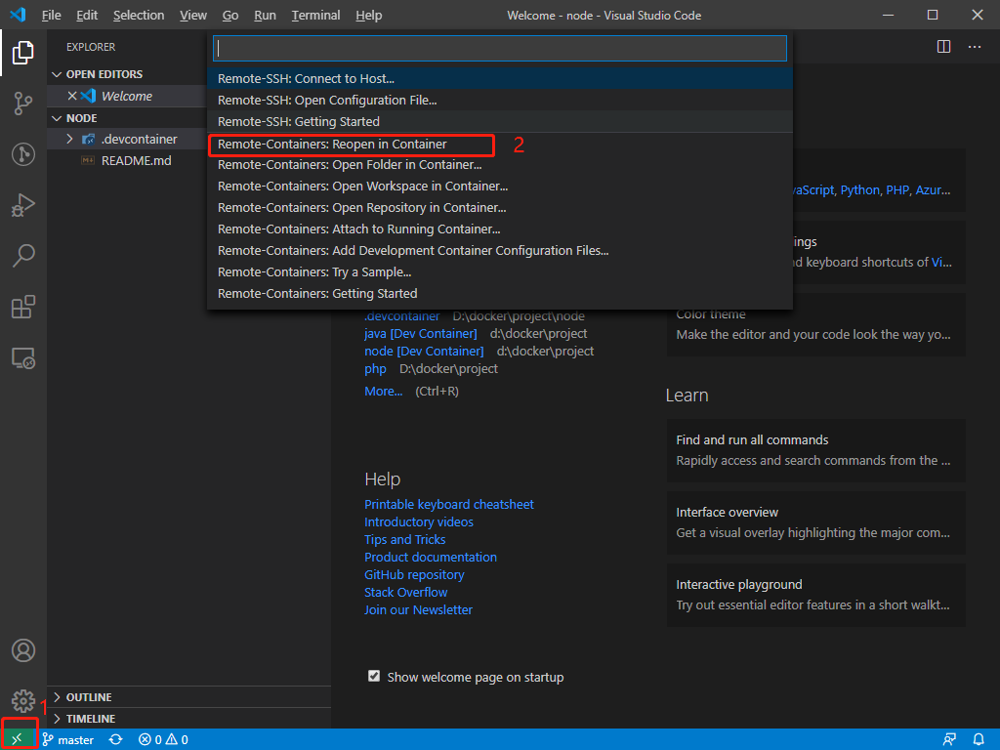

## 简介

本项目结合 VSCode 的 Remote - Containers 插件搭建 Node 开发环境。

## 环境搭建

首先需要安装 Docker 如果是 windows 系统的话则是安装 docker for windows。  
其次 VSCode 需要安装 remote-containers 插件。    

### 开始使用

首先打开 VSCode，然后如下操作。

然后选择本项目。  

最后等待项目启动。

## VSCode扩展

| 扩展名称                                 | 描述 |
| ---------------------------------------- | ---- |
| EditorConfig for VS Code                 |      |
| ESLint                                   |      |
| filesize                                 |      |
| IntelliSense for CSS class names in HTML |      |
| Live Server                              |      |
| Markdown All in One                      |      |
| Path Intellisense                        |      |
| Prettier - Code formatter                |      |
| SCSS IntelliSense                        |      |
| Todo Tree                                |      |
| TSLint                                   |      |
| Vetur                                    |      |